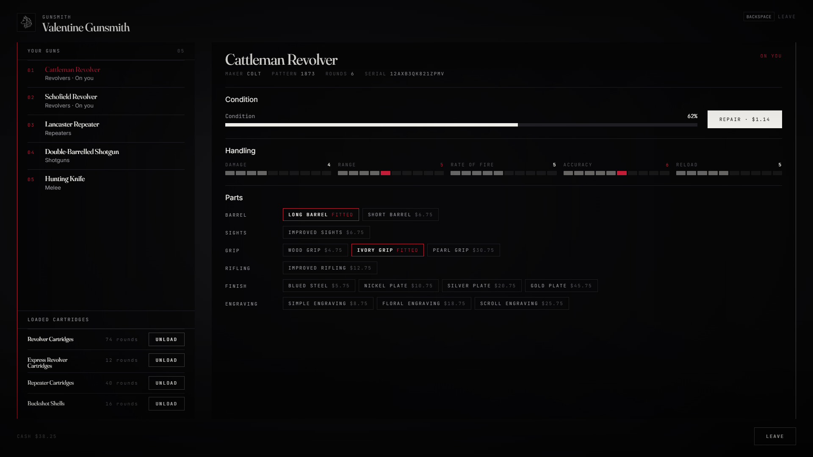

# lxr-weapons — Guns, cartridges and the gunsmith for LXRCore

Every gun is an item with a serial and a condition. Using it draws it; using
it again puts it away. Cartridges are items too: loading them moves rounds
from the satchel into a per-calibre pool the server owns and the game ped
mirrors. Shots wear a gun down, kits and oil bring it back, and the gunsmith
repairs, fits parts and engraves at 1899 prices. Weapon records, cartridges
and the parts vocabulary all come from the core (`shared/weapons.lua`), so
nothing here is a second list to keep in step.



## What it does

* **Draw / holster** — use the weapon item. The server picks the holster:
  two sidearms (the second only for records that allow pairing), two long
  arms, a knife, a bow, a thrower. Limits per category come from the core.
* **Serials** — every gun carries `info.serie`; the loadout is tracked by
  serial, so two identical revolvers are two different guns.
* **Cartridges** — using a cartridge item loads the stack into that calibre's
  pool (`Config.Ammo.maxPool`, per-class caps for shells, arrows, elephant
  rounds). Pools persist in character metadata and are pushed to the ped;
  anything the ped gains that the server never gave is set back.
* **Wear** — the client batches shots every few seconds; the server takes
  `degrade` per shot from the record, warns at 25 % and 10 %, and at 0 % the
  gun jams (attack and aim are blocked until it is cleaned or repaired). The
  game weapon shows the wear (`SetWeaponDegradation`).
* **Field care** — with the gun in hand, a cleaning kit restores 60, gun oil
  20, a whetstone 50 on blades and bows. Durable tools wear instead of
  vanishing; kits are consumed.
* **In the hands** — `/inspect` turns the gun over (the game's inspection animations per category); at the gunsmith the selected gun is held up in front of a camera you drag, wheel-zoom and raise with W/S; field care plays the cleaning loop.
* **Combat** — `Config.Combat`: damage modifier per category and melee, no sprint while aiming, `/infiniteammo` (admin).
* **Gunsmith** — five counters. Repair priced on the item's ledger value and
  how much is missing; parts from `LXRShared.WeaponComponents` (one per
  group, only what the record allows, stat changes drawn on the card);
  engravings and finishes; unloading a pool back into cartridge items.
* **Hooks** — `lxr:weapons:drawn` / `lxr:weapons:holstered` on the server,
  `Player(src).state.weapon` for the HUD and the law, `Disarm(src)` for the
  law, death drops the hands (the guns stay in the satchel).
* **Themes** — LXR Night / LXR Morning from the core's `Config.UI.theme`.
* **Cost** — nothing runs until a gun is carried; one thread at 150 ms while
  it is; per-frame only while a jammed gun is in hand.

## Install

```cfg
ensure lxr-core
ensure lxr-nui
ensure lxr-inventory
ensure lxr-weapons
```

No SQL: serials and condition live in item info, pools in character metadata.

## Configuration

`config.lua` — `Config.Lang`, `Config.Wield` (dual, attach points, death),
`Config.Ammo` (pool caps, load per use, unloading), `Config.Condition`
(wear, jam, care items), `Config.Gunsmiths`, `Config.Prices`,
`Config.Components` (game component names), `Config.Security`.

## API

| Name | Side | Purpose |
|---|---|---|
| `GetLoadout(src)` / `GetDrawn(src)` / `IsArmed(src)` | server | what the character carries and what is in hand |
| `Disarm(src, reason)` / `Holster(src, serial)` | server | take the guns off the ped (they stay in the satchel) |
| `GetAmmo(src, class)` / `AddAmmo(src, class, n)` | server | the calibre pools |
| `SetQuality(src, serial, q)` | server | condition 0–100 |
| `Catalogue(src)` | server | the satchel's guns as the gunsmith sees them |
| `lxr:weapons:drawn` / `lxr:weapons:holstered` (src, name, serial[, reason]) | server | events |
| `Player(src).state.weapon` | both | item name in hand, `false` when unarmed |
| `GetDrawn()` / `IsArmed()` / `Carried()` / `OpenGunsmith(id)` | client | local mirror and the counter |

## Licence

© 2026 iBoss21 / LXRCore — All Rights Reserved. See `LICENSE`.
